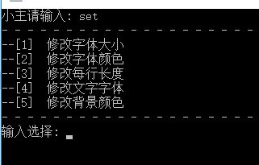
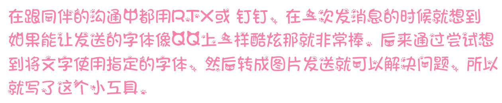

## 项目来源

在跟同伴的沟通中都用`RTX`或 钉钉，在一次发消息的时候就想到如果能让发送的字体像QQ上一样酷炫那就非常棒。后来通过尝试想到将文字使用指定的字体，然后转成图片发送就可以解决问题，所以就写了这个小工具。

## 实现的思路
- 创建画布，将输入的文字写入画布
- 控制格式，字体、背景、字体颜色、字体大小
- 为了方便，将图像数据写入windows的剪贴板缓冲区，使用`CTRL + V `就可以粘贴到聊天框内发送

## 使用方法

打开程序直接输入文字，然后再聊天宽里面`CTRL + V `就可以了。程序又默认的配置，你可以更改你默认使用的字体、字体大小、字体颜色、背景颜色。配置文件是`config.txt`
```json
{
	"maxLen": 30,
	"fontSize": "40",
	"fontColor": "#FA81AB",
	"fontBackgroundColor":"#FFFFFF",
  	"fontType": "萝莉小猫咪体.ttf"
}
```
这里的字体你可以自己去下载喜欢的，放在目录下就可以了。图片的背景颜色是为了让图片跟聊天窗口的颜色相近，体验更好。`maxLen` 是设置图片每行的字数，调整图片文字的段落格式。


我们也可以在程序运行中输入`set`进行设置




下面的就是生成的图片示例：




## 存在的问题

在使用的过程中发现，如果有特殊符号会使每一行最后留下的边距变小，暂时没法解决。

在微信中使用，图片会被缩小，体验不好。


欢迎关注我的公众号，一起讨论有趣的程序。


